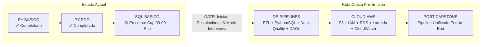

# 03 - Syllabus Maestro 2.0 (Data & Automation Engineer — Pre-Empleo)

> **Versión:** 2.0.0 (DoJo v5.2.0 — Pre-Employment Fast-Track)  
> **Objetivo:** Inserción laboral remota internacional en USD (> $1500/mes) antes de mediados de 2027 como **Data Automation Engineer / Python Automation Developer / ETL Integration Developer**.  
> **Fase 2 (Post-Empleo):** Las ramas de especialización secundaria están desacopladas en [`08-syllabus-post-empleo-fase2.md`](08-syllabus-post-empleo-fase2.md).

---

## 1. Visión y Enfoque de Empleabilidad

El **Syllabus 2.0** define la ruta técnica crítica indispensable para superar los filtros técnicos (Live Coding, Take-Home tests y entrevistas de arquitectura) para roles de ingeniería de datos, automatización de procesos e integraciones ETL en el mercado internacional.

Toda la formación se organiza bajo el estándar **Campaign as Course** ([`07-campaign-as-course.md`](07-campaign-as-course.md)), donde cada materia combina teoría desacoplada (`lore/`), laboratorios de testing (`quests/`), asimilación Feynman (`grimoire.md`) y un proyecto integrador evaluado por el DM (`rite/`).



---

## 2. Estado de Progreso de Chronicles en `subjects/`

| Chronicle | Área | Estado | Competencias Consolidadas |
|---|---|:---:|---|
| **`PY-BASICO`** | Python | ✅ **Done** | Sintaxis, estructuras de datos, control de flujo, scripting base. |
| **`PY-POO`** | Python | ✅ **Done** | Programación Orientada a Objetos, TDD (`pytest`), modularización, logging y fixtures. |
| **`SQL-BASICO`** | SQL | 🟡 **En Progreso** | DDL, constraints, CRUD (Cap 00-02 listos). Pendientes: JOINs, CTEs, Window Functions, ACID, Modelado dimensional (Cap 03-09 + Rite). |
| **`DE-PIPELINES`** | Data Engineering | ⚪ **Pendiente** | Integración Python+SQL, consumo de APIs, Pandas, Data Quality, orquestación DAG local. |
| **`CLOUD-AWS`** | Cloud Computing | ⚪ **Pendiente** | Almacenamiento S3, IAM roles/policies, RDS/Postgres, serverless Lambda, CloudWatch. |
| **`PORT-CAPSTONE`** | Portafolio | ⚪ **Pendiente** | Pipeline monolítico productivo end-to-end + CI/CD en GitHub Actions + README en inglés. |

---

## 3. Bloques Temáticos de la Ruta Pre-Empleo

### 🐍 PY – Python Core & Automation
*Completado en `PY-BASICO` y `PY-POO`.*
- Sintaxis profesional, tipos de datos y manejo de excepciones robusto.
- Programación Orientada a Objetos (clases, herencia, composición, polimorfismo, properties, dunder methods).
- Test-Driven Development (TDD) con `pytest` y fixtures reutilizables.
- Logging estructurado (`logging` module) y manejo seguro de entornos virtuales (`venv`).
- Manipulación avanzada de datos tabulares y colecciones con **Pandas** y serialización **JSON**.
- Consumo e integración de APIs REST con `requests` / `httpx`.

---

### 🗄️ SQL – Bases de Datos Relacionales & Modelado Dimensional
*En ejecución activa dentro de `SQL-BASICO`.*
- Fundamentos relacionales, DDL (`CREATE`, `ALTER`, `DROP`), tipos de datos explícitos y restricciones (`PK`, `FK`, `UNIQUE`, `CHECK`, `CASCADE`).
- Consultas intermedias y avanzadas: `WHERE`, `ORDER BY`, funciones escalares (`CASE WHEN`, `COALESCE`, `CAST`), agregaciones (`GROUP BY`, `HAVING`).
- Relaciones complejas: `INNER`, `LEFT`, `CROSS`, Self-Joins y aliases de tabla.
- Expresiones de tabla común (**CTEs**) encadenadas y subqueries correlacionadas.
- Funciones de ventana (**Window Functions**): `ROW_NUMBER()`, `RANK()`, `DENSE_RANK()`, `LAG()`, `LEAD()`, sumas acumuladas y deduplicación.
- Operaciones de conjuntos (`UNION`, `UNION ALL`, `INTERSECT`, `EXCEPT`) y transacciones **ACID** (`BEGIN`, `COMMIT`, `ROLLBACK`).
- **Modelado Dimensional:** Diferencias clave entre OLTP y OLAP, esquema en estrella (*Star Schema*), tablas de hechos (*Fact Tables*) y dimensiones (*Dimension Tables*), diseño de llaves subrogadas e indexación básica.

> **Nota de Arquitectura sobre SQL:**  
> Las Chronicles anteriormente planificadas como `SQL-PYBRIDGE` y `SQL-DESIGN` quedan formalmente **absorbidas**: el modelado dimensional se integra en la fase avanzada de `SQL-BASICO`, mientras que el puente Python+SQL se ejercita directamente dentro de `DE-PIPELINES`.

---

### 🛡️ DQ – Data Quality & Observabilidad *(Práctica Transversal)*
> **Regla de Arquitectura:** `DQ` no constituye una Chronicle aislada para evitar la proliferación de cursos. Se enseña e implementa integrado en `DE-PIPELINES` y se valida en `PORT-CAPSTONE`.

- Validación de esquemas de entrada y contratos de datos.
- Detección y tratamiento automatizado de nulos, registros duplicados e inconsistencias de tipo.
- Verificaciones de integridad cuantitativa (*Row Count Checks* y reconciliación de balances pre/post carga).
- Estrategias de reintentos con *exponential backoff* ante fallos transitorios de red o API.
- Logging forense estructurado para auditoría de pipelines en producción.

---

### ⚙️ DE – Data Pipelines & Orquestación Básica
*Se enseñará en `DE-PIPELINES`.*
- Arquitecturas y patrones de ingesta: ETL vs ELT y zonas de almacenamiento (*Raw / Bronze*, *Cleaned / Silver*, *Curated / Gold*).
- Extracción automatizada desde múltiples endpoints de APIs REST con autenticación por token/headers.
- Manipulación, limpieza y tipado estricto con Pandas.
- Carga de datos estructurados hacia bases de datos relacionales (Postgres) usando DBAPIs/SQLAlchemy.
- **Orquestación con DAGs:** Introducción práctica a herramientas de orquestación moderna (**Prefect** o **Airflow local**) con tareas dependientes, reintentos automáticos y registro de estados.

---

### ☁️ CLOUD – Cloud AWS Pragmático
*Se enseñará en `CLOUD-AWS`.*
- Fundamentos de arquitectura cloud para ingeniería de datos.
- **AWS IAM:** Creación de usuarios de servicio, roles, políticas de mínimo privilegio y manejo de credenciales mediante variables de entorno (sin hardcoding de llaves).
- **Amazon S3:** Creación de buckets, particionamiento de carpetas por fecha (`year/month/day`), almacenamiento de payloads raw JSON y Parquet.
- **Amazon RDS:** Aprovisionamiento y conexión segura a instancias administradas de **PostgreSQL**.
- **AWS Lambda:** Funciones serverless para tareas ligeras de extracción y disparo de eventos.
- **Amazon CloudWatch:** Monitoreo de logs de ejecución y configuración de alertas de fallo.

---

### 🔄 GIT-CI – Control de Versiones & CI Automático *(Práctica Transversal)*
> **Regla de Arquitectura:** `GIT-CI` no es una Chronicle teórica aislada; se aplica como estándar obligatorio desde `DE-PIPELINES` y se automatiza en `PORT-CAPSTONE`.

- Convenciones de commits semánticos (*Conventional Commits*: `feat`, `fix`, `refactor`, `test`, `chore`).
- Estrategia de branching profesional (*feature branches* y Pull Requests con code review).
- **GitHub Actions:** Creación de workflows `.github/workflows/ci.yml` que ejecutan automáticamente la suite de `pytest`, validación de tipos con `mypy` y linter en cada `push` o `pull_request`.

---

### 🗣️ ENG-INT – Inglés Técnico Aplicado & Mock Interviews *(Práctica Transversal)*
> **Regla de Arquitectura:** Inmersión continua a lo largo de todo el DoJo.

- **Nivel Objetivo:** B2+ funcional enfocado en comunicación técnica fluida para entrevistas internacionales en vivo.
- **Producción Escrita:** Todos los artefactos técnicos de producción (código, nombres de variables, docstrings, tests, commits, pull requests y READMEs) deben redactarse en **Inglés profesional**.
- **Simulacros de Entrevistas (Mock Interviews):** A partir del gate de búsqueda activa, el Operador utilizará personalidades del agente (`witch` / `wizard`) para practicar sesiones socráticas y simulacros de preguntas de arquitectura y código en inglés.

---

## 4. Especificación del Proyecto de Portafolio: `PORT-CAPSTONE`

En lugar de múltiples proyectos pequeños y dispersos, el portafolio se concentra en **1 Proyecto End-to-End Monolítico y Robusto** que demuestre la cadena completa de Data & Automation Engineering:

```
[ Fuente Externa: API REST Pública ]
                 │
                 ▼
[ 1. Ingestor en Python (Requests / Pydantic / Logging) ]
                 │
                 ▼
[ 2. Data Quality Layer (Schema Validation, Null Checks, Deduplication) ]
                 │
                 ├──────────────────────────────┐
                 ▼                              ▼
    [ 3. Raw Storage en AWS S3 ]    [ 4. Transformación (Pandas / SQL) ]
                                                │
                                                ▼
                                [ 5. Carga a RDS/PostgreSQL ]
                                (Modelado Dimensional: Star Schema)
                                                │
                                                ▼
                                [ 6. Post-Load Quality Checks ]
                                (Reconciliación de Row Counts)
                                                │
                                                ▼
                        [ 7. Orquestación Periódica ]
                        (DAG en Prefect/Airflow con reintentos)
                                                │
                                                ▼
                        [ 8. Monitoreo & Logs (CloudWatch) ]
```

### Entregables del Capstone:
1. **Repositorio Público en GitHub:** Estructura modular limpia (`src/`, `tests/`, `config/`, `.github/workflows/`).
2. **CI/CD Activo:** GitHub Actions corriendo `pytest` en cada commit.
3. **README Profesional en Inglés:** Justificación de arquitectura (por qué ETL vs ELT, trade-offs de la herramienta de orquestación elegida, diagrama de flujo y métricas de rendimiento).
4. **Video Demo / Loom (3-5 min):** Explicación del pipeline en inglés destacando decisiones de diseño y manejo de errores.

---

## 5. El Disparador del Gate de Búsqueda Activa

> [!IMPORTANT]
> **GATE DE BÚSQUEDA PARALELA:**
> El proceso de postulación a empleos **NO espera** a que el portafolio esté finalizado.
> 
> * **Hito de Activación:** Se dispara formalmente al **aprobar el Rite de `SQL-BASICO`**.
> * **Justificación Técnica:** Con `PY-POO` (Python avanzado + OOP + TDD) y `SQL-BASICO` (DDL, JOINs, CTEs, Window Functions), el Operador cuenta con las credenciales para superar el 80% de los filtros de *live coding* y screening técnico inicial.
> * **Acción a partir del Hito:** Se reserva un bloque semanal fijo dentro de la rutina para enviar entre 5 y 10 postulaciones en plataformas internacionales (LinkedIn, Wellfound, RemoteOK, Arc.dev) y realizar mock interviews en inglés mientras se desarrollan `DE-PIPELINES`, `CLOUD-AWS` y `PORT-CAPSTONE`.
