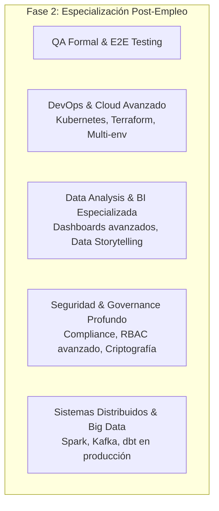

# 08 - Syllabus Maestro: Fase 2 (Post-Empleo & Especialización)

> **Estado:** En pausa activa (Documento de referencia para la etapa post-contratación).  
> **Propósito:** Definir las áreas de especialización técnica que se activarán una vez asegurado el primer rol profesional en la industria como Data & Automation Engineer.

---

## 1. Contexto y Filosofía de Fase 2

Este documento alberga las ramas de especialización técnica que formaban parte del blueprint original pero que fueron desacopladas de la ruta crítica de inserción laboral (Syllabus 2.0 en [`03-syllabus-maestro.md`](03-syllabus-maestro.md)). 

El objetivo de Fase 2 es profundizar hacia roles de **Senior Data Engineer**, **Data Platform Engineer** o **Data Architect** una vez se cuente con un primer empleo remoto profesional, evitando la dispersión de energía y la saturación durante la fase de búsqueda inicial.

---

## 2. Bloques de Especialización (Fase 2)

---

### 🧪 QA – Testing Formal & Quality Assurance Avanzado
- Fundamentos de testing formal y metodologías de prueba empresarial.
- Testing automatizado End-to-End (E2E) para aplicaciones completas.
- Especificación formal de casos de prueba (test plans, test cases corporativos).
- Reportes forenses de bugs y métricas de cobertura de código (*Code Coverage > 90%*).
- Testing de rendimiento y pruebas de carga de pipelines de datos.

---

### ⚙️ DEV – DevOps, Infraestructura como Código (IaC) & Kubernetes
- Contenedorización avanzada y orquestación con **Kubernetes (K8s)** (Pods, Deployments, Services, Helm charts).
- Infraestructura como Código (**Terraform** / CloudFormation) para aprovisionamiento multi-entorno (Dev, Staging, Prod).
- Pipelines de CI/CD avanzados con rollback automatizado, canary deployments y security scanning.
- Monitoreo y observabilidad de clústeres distribuidos (Prometheus, Grafana).

---

### 📊 DA – Data Analysis, BI & Data Storytelling Especializado
- Análisis exploratorio de datos avanzado (EDA multivariado, pruebas estadísticas de hipótesis).
- Construcción de dashboards analíticos complejos y autoservicio (Tableau, Power BI, Streamlit avanzado).
- Técnicas de *Data Storytelling* e interlocución directa con C-Level y Product Managers.
- Modelado analítico y métricas de negocio avanzadas (LTV, Churn, Cohort Analysis).

---

### 🔒 SEC – Seguridad Avanzada, Gobierno de Datos & Compliance
- Gobierno de datos corporativo y linaje de datos (*Data Lineage* y catálogos con herramientas como DataHub / OpenMetadata).
- Control de acceso basado en roles granular (**RBAC / ABAC**) y políticas de auditoría estricta.
- Cifrado en reposo y en tránsito (KMS avanzado, rotación automática de llaves).
- Cumplimiento normativo y privacidad de datos (**GDPR**, **CCPA**, **SOC2** en pipelines).

---

### 🚀 SCALE – Big Data & Procesamiento Distribuido (Opcional Futuro)
- Procesamiento batch y streaming distribuido con **Apache Spark (PySpark)** y **Apache Kafka**.
- Transformación dimensional escalable con **dbt Core/Cloud** en Data Warehouses (Snowflake, BigQuery, Databricks).
- Arquitecturas Lakehouse (Delta Lake, Apache Iceberg).

---

## 3. Protocolo de Reactivación

1. **Condición de Activación:** Tener contrato firmado en rol de Data Automation / Python Automation / ETL Developer.
2. **Priorización Dinámica:** Las materias de este documento se seleccionarán en función del stack real de la empresa contratante para acelerar la promoción y el impacto dentro del equipo.
